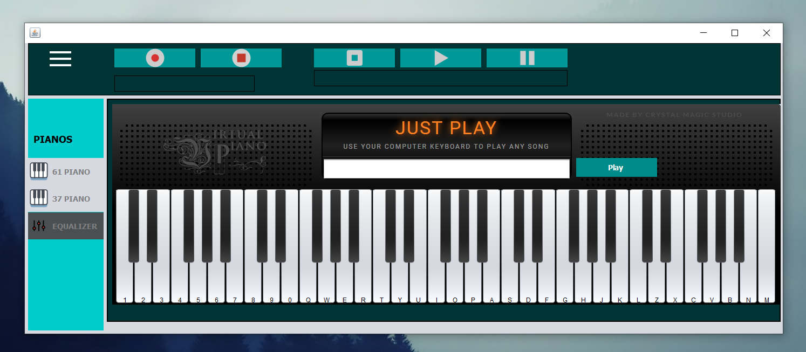

# Virtual Piano
 
## Short Description
Our first ever java project. We tried to make a piano simulator where anyone can play piano using keyboard.

## Project Setup

1. [Go to the github project URL](https://github.com/Shahriar1212/VirtualPiano)
2. Download the project zip file
3. Unzip the project
4. open dist folder from project directory
5. You will get an executeable jar file named 'VirtualPiano'
6. Run and play some music :) 

  
